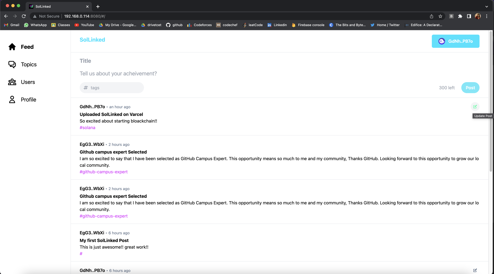

<h1 align="center">SolLinked</h1>

SolLinked is a decentralised application (dApp) that makes it simple to submit your achievements on the Solana Blockchain. It supports two wallets, each of which offers a simple way to complete a transaction. You can easily post and update your achievement on SolLinked. It provides three sections i.e. Title, Content and Tag to describe our achievement. 

Note: Currently the dApp in deployed on Devnet and Vercel.
  
  

## What it does :
- Users may log in to the app by connecting their wallet. 
- Only logged-in users will be allowed to create a post with up to 300 characters of content, 50 characters of title, and 20 characters of tag. 
- Users will be able to read tweets even if they are not signed in. 
- Topics may also be searched using tags, and users can be found by their wallet ID. 
- In the Profile area, you may also see your own posts.

### Screenshot

## 👇 Prerequisites

Before installation, please make sure you have already installed the following tools: 
- [Solana](https://docs.solana.com/cli/install-solana-cli-tools) 
- [Rust](https://www.rust-lang.org/tools/install)
- [Yarn](https://project-serum.github.io/anchor/getting-started/installation.html#install-yarn_)
- [Anchor](https://github.com/project-serum/anchor)

some other optional prerequisites if you are interested in contributing.
- [Git](https://git-scm.com/downloads)

## 🛠️ Installation Steps

1. Fork the project
2. Clone the project
3. Create a new branch `git checkout -b new-feature`
4. One can find smart contract in the ``program-rust/programs/sol_linked/src/`` directory.
5. Make your changes and build the program by running ``anchor build``
6. Once built, connect to any [cluster](https://docs.solana.com/cli/choose-a-cluster) and run the deploy command which you got at the end of build command or just run ``anchor deploy``.
7. Add the IDL created to the app folder by running the command ` anchor run copy-idl `
8. Once all the appropriate changes are done in the files ` git add . `
9. Add changes to reflect the changes made `git commit -m 'commit message'`
10. Push to the branch ` git push `

## 👨‍💻 Contributing

- Any contributions you make are **greatly appreciated**.

### Bug / Feature Request

If you find a bug in the dApp/website, kindly open an issue [here](https://github.com/anamansari062/SolLinked/issues/new) by
including a proper description about the bug and the expected result. Similarly, I would be glad to hear about new
features to add in the project, kindly follow same procedure for it too.

## 🛡️ License

SolLinked is licensed under the MIT License - see the [`LICENSE`](LICENSE.txt) file for more information.

## 🙏 Support
Do ⭐️ the project if you like it :)
